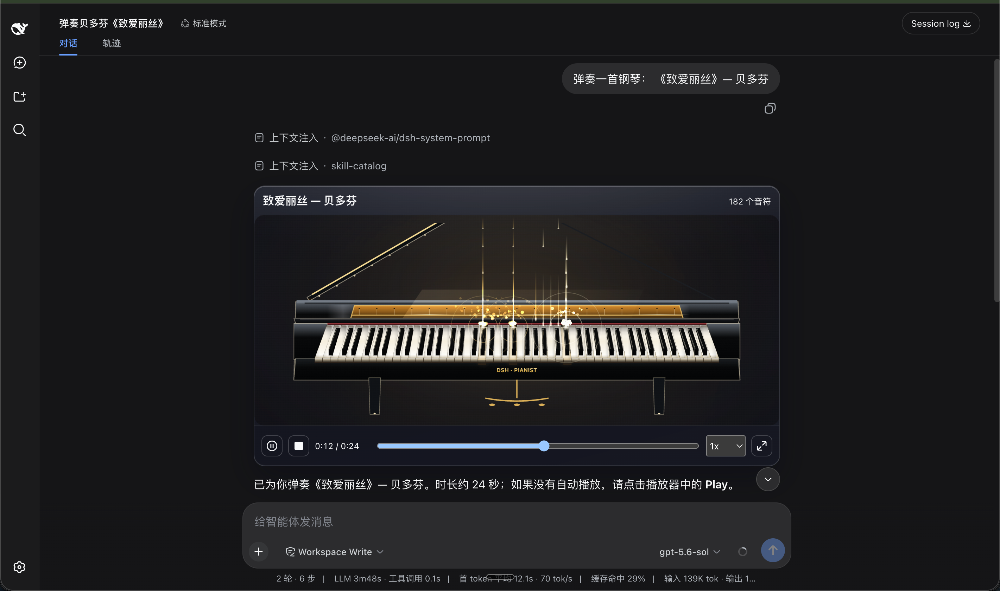

# dsh-pianist

[中文](./README.md) · [English](./README.en.md)

dsh-pianist 为 [DeepSeek Harness](https://github.com/deepseek-ai/deepseek-harness)（`dsh`）Web UI 带来一台会弹琴的 Agent：写代码累了，让 AI 弹一曲放松；它弹得多好，就是模型的本事。是玩具，也是考卷。

项目主页：<https://laplace-bit.github.io/dsh-pianist/>

[](https://www.npmjs.com/package/dsh-pianist)
[](./LICENSE)
[](https://www.typescriptlang.org/)
[](./CONTRIBUTING.md)

## 效果

[](./docs/showreel.mp4)

点上面封面看演奏短片（[`docs/showreel.mp4`](./docs/showreel.mp4)），或者到[在线 Demo](https://laplace-bit.github.io/dsh-pianist/) 点一曲，听实时渲染。

## 它弹起来什么样

- 音色来自 Salamander Grand Piano V3 的真实录音采样，六层力度、键释放、弦共振、踏板动作都有，不是合成器那种"哔哔"声。
- 两套皮肤随时切：曜黑鎏金，黑色高光三角琴配暖金内饰，落键泛金光；樱花珍珠，珍珠白琴身、玫瑰金细节，头顶一片樱色天光。
- 全屏沉浸式舞台里有瀑布音符、水光倒影、流星和薄雾，跟着演奏起伏。
- 88 个键都能弹：鼠标滑奏、电脑键盘、方向键选音，想自己上手也行。
- 底层是一条确定性时间轴。暂停、拖动、重播，同一份乐谱每一次都分毫不差。所以它能当考卷用：模型会不会弹琴，一弹便知。

## 安装

在 DeepSeek Harness 源码仓库里：

```sh
pnpm dsh plugin --profile web add dsh-pianist
```

如果 `PATH` 上已经有 `dsh`：

```sh
dsh plugin --profile web add dsh-pianist
```

npm 包自带构建产物，装完就能用。

然后启动界面：

```sh
pnpm dsh web
```

卸载：`pnpm dsh plugin --profile web remove dsh-pianist`（或 `dsh plugin --profile web remove dsh-pianist`）。

## 内核兼容性

| DSH 内核 | 本插件支持情况 |
|---|---|
| 0.1.0-rc.5 ～ 0.1.0-rc.7 | ✅ 全部版本 |
| 0.1.1-rc.2 | ✅ 全部版本 |
| 0.1.2-alpha.1 ～ 0.1.2-alpha.3 | ✅ 0.1.0（含 2026-09-01 兼容修复的构建）；此前发布版在 0.1.2 上加载失败 |

- ✅ = 兼容。`0.1.2-alpha.3` 为当前宿主内核，已实测（产物导入 + 测试套件）；其余内核按双内核兼容设计支持（同一份构建、同一 API 面）。
- **0.1.2 起内核移除了 `settingsNamespace()` 运行时助手**（≤ 0.1.1 上它只是个校验恒等函数，0.1.2 仅保留同名类型）。本插件不静态导入该符号，而是在注册设置命名空间时本地内联常量并断言为 `SettingsNamespace` 类型，新旧内核通用。
- 当前构建不再静态导入 `settingsNamespace()`；此前发布版仅在 ≤ 0.1.1 内核上可用，请重新构建或更新至含修复的版本。
- **不要对 `@deepseek-ai/*` 包的运行时符号做静态导入**。宿主 CLI 经 `node --import tsx/esm` 启动，tsx 会应用宿主 `tsconfig` 的 `paths` 映射，外部插件对 `@deepseek-ai/*` 的裸导入可能被重定向进宿主源码，一旦宿主侧改名/删符号就会以模块实例化错误的形式炸掉启动。类型导入（`import type`）不受影响。

## 使用

装好后直接用自然语言点歌，Agent 会把整段乐谱交给钢琴：

```text
请弹一下《欢乐颂》前八小节，双手都要，带延音踏板。
来一段 C 大调音阶，100 BPM，放慢一点。
即兴来首轻快的小曲子，放松一下。
```

浏览器可能要先手动点一次播放按钮才出声，这是浏览器的自动播放限制，属正常现象。

在 **Settings -> Plugins -> Pianist** 卡片里可以随时调整：

- 启用/停用插件，切换皮肤（曜黑鎏金 / 樱花珍珠）；
- 沉浸式舞台或聊天卡片两种形态，演奏结束后自动回到卡片；
- 画质（低/中/高）、音量、瀑布音符、踏板与粒子特效开关。

改完保存即生效。

## 许可证

插件代码 MIT。内置钢琴录音来自 Salamander Grand Piano V3（CC BY 3.0），署名见 [`THIRD_PARTY_NOTICES.md`](./THIRD_PARTY_NOTICES.md)。

<details>
<summary>开发者信息（浏览器嵌入 / 本地演示）</summary>

独立网页可通过 npm 引入并注册 Web Component：

```ts
import { registerDshPianoView } from 'dsh-pianist/demo';
registerDshPianoView();
// <dsh-piano-view> 提供 setScore / setPianistSettings / play / pause /
// seek / setRate / requestImmersive 等公开 API。
```

设置卡片经由 `settings.plugin.item` 注册于 Settings -> Plugins。本地预览落地页
[`docs/index.html`](./docs/index.html)：`pnpm run build && pnpm dlx serve .`。

</details>
